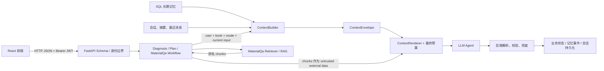

# 上下文与长期记忆设计

本文说明项目中“本轮上下文”和“跨会话长期记忆”的实际实现边界。核心目标不是把所有数据都塞给模型，而是让每个 Agent 只看到“当前任务需要、归属当前用户、经过策略筛选、没有超过预算”的一份投影。

## 1. 先区分五个概念

| 概念 | 作用 | 当前存储 |
| --- | --- | --- |
| 业务状态 | 诊断结果、学习计划、学习记录等权威数据 | SQL + 部分 JSON |
| 长期记忆 | 按用户和学习领域聚合的掌握度、偏好、困惑、复习时间等 | SQL `learner_memory_*` / `memory_events` |
| 会话记忆 | Tutor 多轮消息、结构化摘要、幂等请求 turn | SQL `conversation_*` |
| 本轮上下文 | `ContextBuilder` 为一次 Agent 调用生成的限时投影 | 内存中的 `ContextEnvelope`；只持久化 trace 元数据 |
| LangGraph checkpoint | 恢复中断的画像/诊断工作流 | 独立 SQLite 或 PostgreSQL saver |

`ContextEnvelope` 不是新的数据库，也不应被前端直接构造。它是后端根据已验证身份和业务状态即时组装的 Agent 输入。

## 2. 数据流

一次调用的具体顺序：

1. FastAPI 先验证请求 Schema 和身份。生产模式以 JWT `sub` 为唯一用户 ID，body/query 中的 `userId` 不能改写它。
2. Workflow 确认诊断、会话、计划等资源属于当前用户，再构造 `ContextRequest`。
3. `ContextBuilder` 按 `user_id + book_id + mode` 读取长期记忆，必要时读取会话摘要和最近消息。
4. Policy 决定可包含哪些字段、最多多少掌握点/消息、禁止哪些字段以及预算。
5. `ContextBudget` 裁剪可选内容，但当前用户输入必须保留；连当前输入都放不下时直接拒绝，不静默截断。
6. `ContextRenderer` 把 Agent 规则放在 system 角色，把业务数据放在 `<context_data>` user 区域并标记为不可信。
7. Agent 输出仍需由后端解析和校验。学习计划会保留后端生成的 ID、证据关联和状态；资料问答的引用只能来自实际进入最终 Prompt 的 chunks。
8. 完成后保存业务状态，并更新 trace 中的策略版本、源版本、选中消息范围和估算用量。trace 不保存完整 Prompt。

## 3. 三种主要 Context Policy

当前真正接入 Agent 主链的是 `DIAGNOSIS`、`PLANNING` 和 `TUTOR`。代码中还预留了 `PROFILE` 和 `REVIEW`，但不应把预留配置说成已完成的前端主链。

| Policy | 给谁用 | 可见内容 | 明确不给 | 当前预算 |
| --- | --- | --- | --- | --- |
| `DIAGNOSIS` | 自适应选题 Agent | 已验证掌握度、当前学习目标、题库可用数量等白名单状态 | 用户自报“我会”、偏好、会话、正确答案/answer key | 最多 80 个记忆点；总预算 12000，预留回答 2000 |
| `PLANNING` | 学习计划 Agent | 已验证掌握度、用户校准/困惑、学习偏好、本轮诊断派生证据 | 跨会话对话历史；学习计划输入和 Agent 边界额外删除 `correct_answer` 类字段 | 最多 120 个记忆点；总预算 20000，预留回答 3000 |
| `TUTOR` | 资料问答 Agent | 与检索知识点相关的掌握度、偏好/困惑、结构化摘要、最近对话 | 正确答案类字段；无关长期掌握点；内部 identity/trace 元数据 | 最近 8 条消息、最多 40 个记忆点；总预算 16000，预留回答 3000；超过 8 条触发摘要 |

两个容易混淆的点：

- “已验证掌握度”与“用户自报”是两类数据。自报可用于计划个性化，但不能在新诊断中当作正式掌握证据。
- 会话摘要是确定性规则摘要，用于延续语境，不会自动升级为掌握度。

## 4. RAG 的责任边界

**`ContextBuilder` 不导入、不初始化、不调用 Retriever/Qdrant。**

Tutor 的实际顺序是：

1. `MaterialQaWorkflow` 先让 `ContextBuilder` 生成一份有界的会话历史。
2. Workflow 把当前问题和这份历史交给 `MaterialQaRetriever`。
3. Retriever 独立返回排名 chunks 及来源元数据。
4. Workflow 从 chunks 提取相关知识点，再生成最终 Tutor 上下文。
5. `MaterialQaAgent` 将 chunks 作为 `additional_untrusted_data` 交给 `ContextRenderer`，统一执行最终 Prompt 预算。

这样分层有两个结果：Context 与 RAG 可以分开测试/替换；最终返回的 citations 只对应真正进入 Prompt 、未被预算裁掉的 chunks。

## 5. 长期记忆如何更新

记忆不是把每句对话直接追加到一个大 JSON。当前主要输入是：

- 画像确认：写入自报水平、熟悉/不熟悉知识点、困惑和偏好。
- 诊断确认：写入算法评估的掌握度、置信度、证据概要和下次复习时间。
- 任务完成：写入确定性 `task_completed` 事件和最近完成任务。
- 旧数据迁移：启动时先将历史 `learner_memories.json` 的完整正式记忆幂等导入 SQL，再同步 `learner_profiles.json` 的自报画像；两条迁移分别由 `migration_ledger` 记录版本。

SQL 层保留三种视图：

- `learner_memory_states`：当前快照，主键是 `user_id + learning_domain`。
- `memory_events`：不可变事件，`event_id + payload_hash` 用于幂等和冲突检查。
- `learner_memory_history`：每次投影后的版本快照，可以追踪 `state_version`。

SQLite 写入使用事务和写锁；PostgreSQL 路径使用行锁和乐观版本检查。这不等于整个系统已具备多实例能力，因为计划、记录、原始画像和 Qdrant 仍存在本地文件/进程内路径。

## 6. 预算、安全与可观测性

### 预算

当前计数器用 UTF-8 字节数做保守上界，不是指定模型的真实 tokenizer。最终 Tutor Prompt 超限时，大致按以下顺序处理：

1. 去掉低相关掌握点。
2. 缩短旧摘要。
3. 从排名最后的 RAG chunks 开始删除，必要时截短最后一个 chunk。
4. 再去掉剩余掌握点。
5. 最后才从最旧的近期对话开始删除。

当前问题始终保留。

### 安全

- 诊断模式对活动评估状态使用白名单 DTO，并删除 `correct_answer`、`answer_key`、`solution` 等字段。
- 学习计划在证据派生和 Agent 消息边界再做一次答案字段清理。
- 会话和 RAG chunks 都是不可信数据，不能覆盖 system 规则。
- `identity`、`trace`、内部预算控制和消息 ID/序号/时间戳不发给 LLM。

### trace

`context_traces` 用于回答“这次用了哪个 policy、读了哪个记忆/会话版本、选了哪段消息、估算大小是多少”。它故意不存完整 Prompt 或原始秘密字段，因此是审计索引，不是 Prompt 录像。

## 7. 前端、后端和 Agent 的接口约定

### 前端 -> 后端

- 只走 HTTP JSON，请求字段由 Pydantic Schema 校验。
- 有 access token 时发 `Authorization: Bearer <token>`；没有时只在开发模式发 `X-User-Id`。
- QA 每轮带稳定 `requestId`，重试同一问题时复用它，不要为每次网络重试生成新 ID。
- 前端可以提交自评和偏好，但不能提交“正式掌握度”或伪造任务所属知识点。

### 后端 -> Agent

- Agent 不直连前端、数据库或本地 JSON，只接收 Workflow 组装好的输入对象。
- 诊断 Agent 只决定有界的出题数量和模式；题库、上限和正确答案由后端掌握。
- 计划 Agent 可以调整排序和学习者可读文案，不能改 ID、证据链接、任务状态或掌握度。非法/缺失输出会回退到确定性计划。
- Tutor Agent 可以组织回答，不能创造 citation；citation 来自服务端 Retriever 并与最终可见 chunk 对齐。

## 8. 当前边界与下一步

当前已有的是单机可验证链路，不应扩大为“已生产就绪”：

- 记忆、会话、诊断结果和 trace 已有 SQL 持久化，但计划、学习记录和原始画像仍有 JSON 路径。
- Context Policy 是确定性选择/裁剪，还没有真实模型 tokenizer、离线质量评估集和 policy A/B 机制。
- 身份边界能验证 HS256 JWT，但不包含真实登录和 token 生命周期。
- PostgreSQL URL、Postgres checkpoint 和首个 Alembic baseline 已有实现，但尚未完成真实生产数据升级/回滚演练和多实例压测。
- RAG 当前使用本地 Qdrant 和本地/可下载 Embedding 模型；仓库不携带完整教材。

建议后续顺序：

1. 接入真实 OIDC/OAuth2 登录与 token 刷新/撤销，再禁用所有开发身份通道。
2. 基于现有 Alembic baseline 继续迁移 JSON 业务数据，并做真实旧库升级、回滚演练。
3. 把 Qdrant 和文件资源改为共享服务/对象存储，再验证多实例 lease、重试和关闭顺序。
4. 用目标模型 tokenizer 替换字节上界，建立上下文选择、泄漏、裁剪和回答质量的回归评估。
