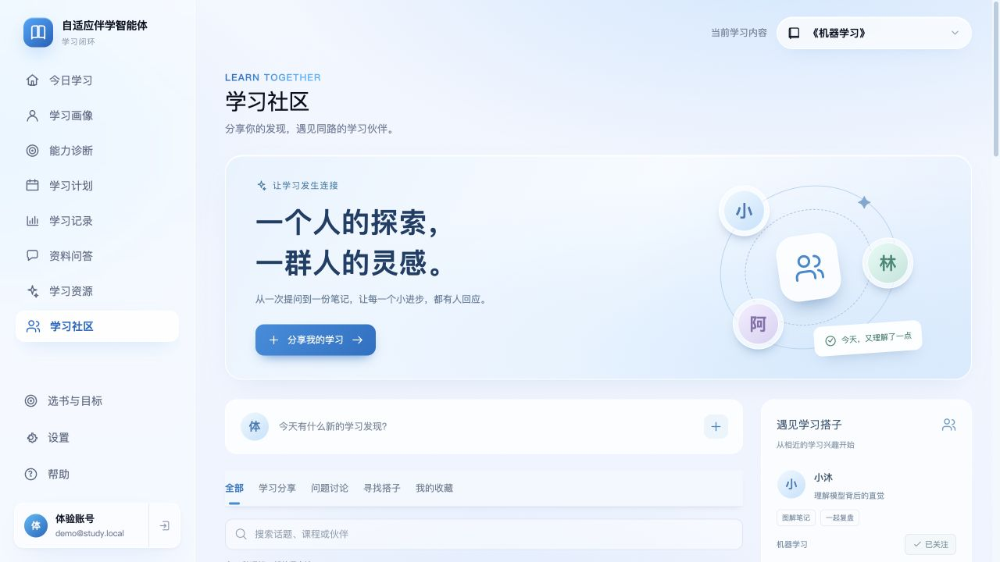
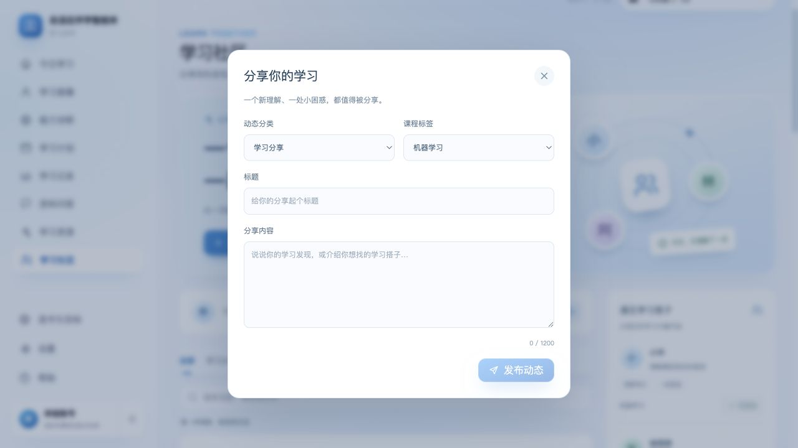

# 学习社区：前端交互演示

入口：登录后，在原有侧栏的「学习资源」下方选择「学习社区」。

桌面布局采用固定视窗框架：左侧导航保持不动，右侧课程栏与页面内容一起滚动，最右侧滚动条从窗口顶部开始；社区分类栏轻量吸顶，搜索及伙伴推荐随页面滚动。公共布局说明见 [桌面工作区布局](workspace-layout.md)。

## 范围

- 本次仅交付桌面 Web 页面，不包含手机端。
- 延续现有天蓝玻璃卡片主题，新增动态流、学习搭子、主题小组。
- 支持分类 / 文本搜索、发帖、点赞、收藏、评论、资料弹窗、关注、小组加入 / 退出。
- 虚拟人物和动态集中在 `src/data/communityMockData.ts`，没有外部头像请求。
- 社区不调用 API、不修改数据库、学习计划、掌握度或长期记忆。
- 示例人物、点赞数、内容均为演示素材，不代表真实用户和运营成果。
- 展示界面使用「发布动态」「重置社区」等产品文案，不再常驻显示示例标签和本地存储说明；数据范围及实现状态以本开发文档为准。存储失败提示和重置前的数据清除确认仍保留。
- 操作按用户保存于 `study-companion.community.v1.<encodedUserId>`；不跨设备同步、不发送通知。
- 每个用户最多保留最近 100 条本地帖子、500 条本地评论；存储不可用时仅保留当前页面会话内的互动，并显示提示。
- 「重置社区」经确认后只清除当前用户的社区操作，不清除认证或其他学习数据。

## 本地运行（无后端）

```sh
cd front/frontend
pnpm install --frozen-lockfile
VITE_USE_REAL_API=false pnpm dev
```

使用项目已有体验账号登录（见根目录 README）。该配置复用已有模拟服务，不改变正常部署的默认 API / 认证配置。

```sh
pnpm run build
node --test tests/community-state.test.mjs
```

状态测试利用 Node 原生 TypeScript 类型擦除，需 Node 22.18+ 或 Node 24+。

## 人工验收

1. 打开学习社区，检查桌面主题风格、侧栏高亮与动态 / 伙伴双栏布局。
2. 搜索「学习率」，切换分类；输入不匹配的词时显示空状态。
3. 点赞 / 取消，收藏后在「我的收藏」查看，取消收藏后移出列表。
4. 发帖和评论：空白内容不能提交；有效内容立即显示；文本按普通文字渲染。
5. 查看伙伴资料，关注 / 取消关注；加入 / 退出主题小组。
6. 切换页面、刷新、重新登录同一账号，社区操作仍保留；换账号不共享本地操作。
7. 弹窗支持 Tab 焦点限制、Escape 关闭和返回触发按钮。
8. 重置社区先显示确认，取消不丢数据；确认不影响画像和学习计划。
9. 回到今日学习、诊断、学习计划和学习资源，确认原有导航正常。

## 文件结构

- `components/CommunityView.tsx`：页面、弹窗和交互。
- `components/community.css`：社区命名空间内的桌面样式。
- `data/communityMockData.ts`：可替换的展示素材。
- `data/communityState.ts`：校验、状态转换与本地存储。
- `tests/community-state.test.mjs`：状态及存储边界回归测试。

未来如需接入真实社区服务，可替换数据与存储层；内容审核、通知、跨设备同步、真实好友关系不属于本次前端演示范围。

## 本次验证记录

- `pnpm run build` 通过，沿用现有锁文件，未增加依赖。
- `node --test tests/community-state.test.mjs`：15 项通过。
- 在本地模拟模式下通过体验账号完成搜索、分类、空状态、发帖、评论、点赞、收藏、关注、小组加入和页面切换检查。
- 刷新后发帖、关注及加入状态仍保留；恢复确认框取消后数据不变。
- 1280px 桌面检查通过；导航图标补充可访问名称。
- 弹窗居中、Escape 关闭正常；原有今日学习、学习计划、学习资源导航正常，浏览器未捕获控制台错误。
- 账号隔离、存储异常、确认恢复后的状态清理通过状态单元测试验证。

## 页面截图

下图使用项目内置体验账号和本地模拟数据。





